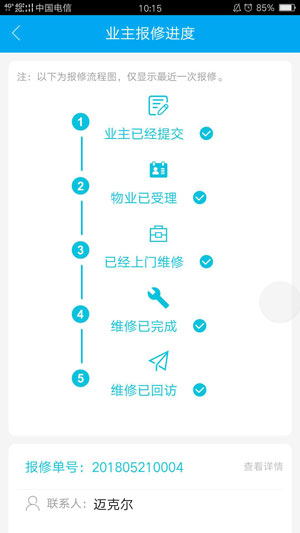
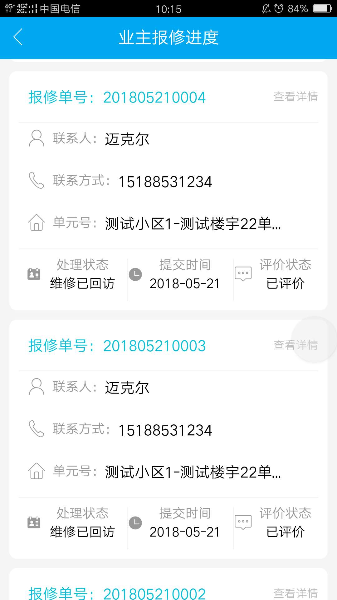
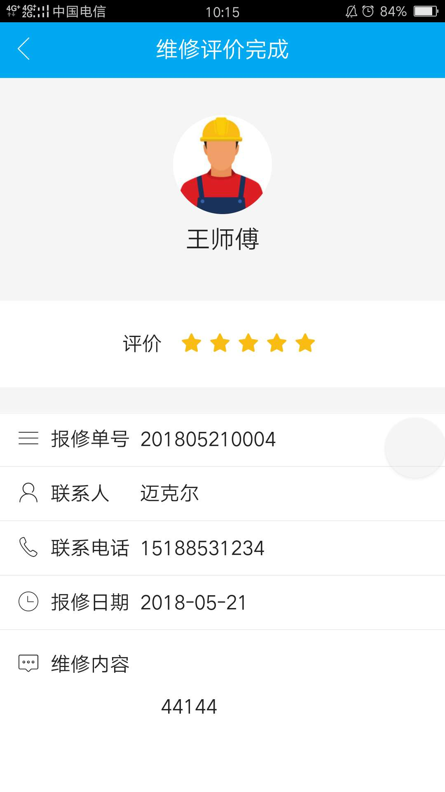

# PropertyWarranty-ApiCloud

###描述

工作中的部分业务demo，实现一个物业报修系统。主要功能包括：业主报修信息提交,报修进度流程，满意度评价，管理中心审核，维修师傅接单，维修情况汇报等。

###技术栈

apicloud vue mcm云数据服务 

###项目截图

 
 
 

###文件目录

####owner  业主报修  - 文件夹

	  owner			 业主报修-title

  	  owner_body			表单提交页

	  owner_process			进度展示页-title

	  owner_process_body		进度展示页-内容

	  owner_details			报修详情页-title

	  owner_details_body		报修详情页-内容

	  owner_evaluate		维修评价-title

	  owner_evaluate_body		维修评价-内容

	  evaluate_complete		维修评价完成-title

	  evaluate_complete_body	维修评价完成-内容

####admin   物业管理员 - 文件夹

	 admin			 物业管理-title

	  admin_body			 物业管理内容

	  admin_details   		 表单title --已发布

	  admin_details_body   		 表单内容  --已发布

      admin_handle   		 处理中title  --处理中

	  admin_handle_body   		 处理中内容  --处理中

	  admin_complete		 物业管理内容 --已成功 Tab

	  admin_complete_body1		 维修信息内容 --已成功

	  admin_complete_body2		 回访内容 --已成功

####master   维修师傅 - 文件夹

	 master			 维修师傅-title

	  master_body			      维修师傅内容

	  master_details   		      表单title --已发布

	  master_details_body   	 表单内容  --已发布

      master_handle   		     处理中title  --处理中

	  master_handle_body   		 处理中内容  --处理中

	  master_complete		      维修师傅内容 --已成功 Tab

	  master_complete_body	      维修信息内容 --已成功

